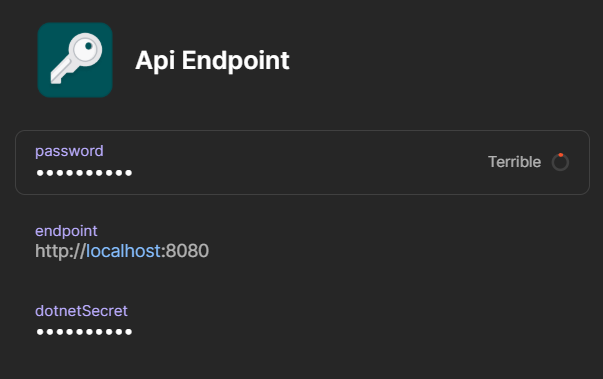

❤️ This project is royalty free and open source, so if you using and love it, you can support it by becoming [Github sponsor](https://github.com/sponsors/bielu) ❤️

Readme will be updated soon.
# Bielu OnePassword Connect Secrets configuration provider for Microsoft.Extensions.Configuration
The Bielu.OnePassword.Connect.Aspnet.Secrets package allows storing configuration values using OnePassword.

## Getting Started

### Install the package

Install the package with [NuGet][nuget]:
```dotnetcli
dotnet add package Bielu.OnePassword.Connect.Aspnet.Secrets
```
### Prerequisites
Make sure you have the OnePassword Connect setup and running. (For details see: https://developer.1password.com/docs/connect/)
### Additional information
The secrets will be loaded from the OnePassword Connect endpoint. The names will normalized to configuration Key format, so spaces and periods will be replaced with `:`.
- Example record:, will result in following secrets populated:
    ```json
     {  
        "Api:Endpoint" : {
            "Password": "Password",
            "Endpoint": "http://localhost:8080",
            "dotnetSecret": "secret value"
        }
    }
    ```
## Examples

To load initialize configuration from One Password connect secrets call the `AddOnePasswordConnect` on `ConfigurationBuilder`:

```C# Snippet:ConfigurationAddAzureKeyVault
ConfigurationBuilder builder = new ConfigurationBuilder();
builder.AddOnePasswordConnect("<OnePasswordConnectEndpoint>",  "<token>");

IConfiguration configuration = builder.Build();
Console.WriteLine(configuration["MySecret"]);
```

## Next steps

Read more about [configuration in ASP.NET Core](https://learn.microsoft.com/en-us/aspnet/core/fundamentals/configuration/?view=aspnetcore-3.1).
